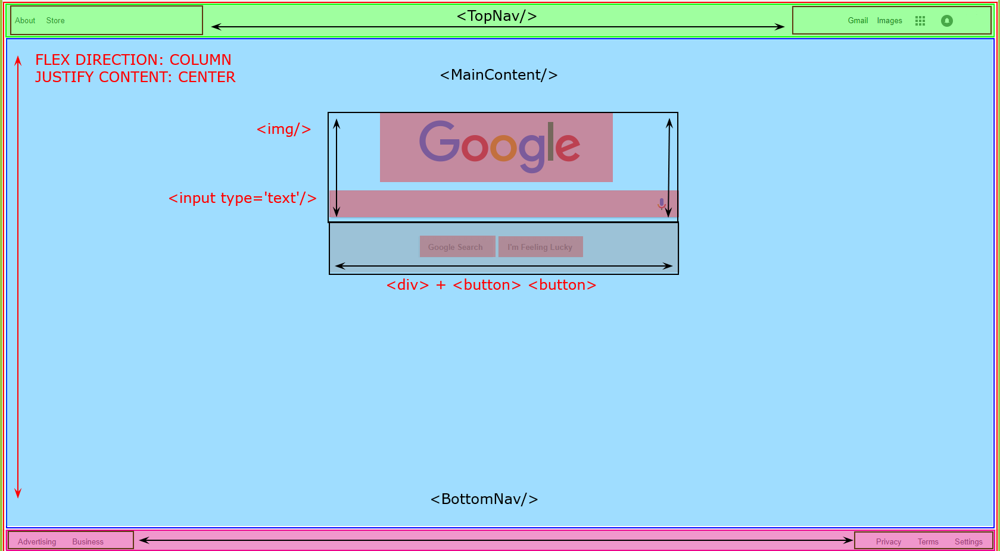
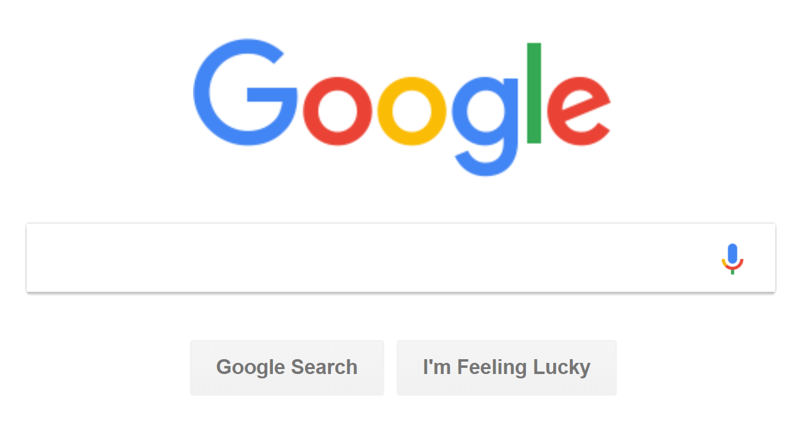

# Google Homepage Clone
### Google Logo
* https://www.google.com/images/branding/googlelogo/1x/googlelogo_color_272x92dp.png
* Dimensions: width: 272px | height: 92px
* Background Color: `#FFFFFF`

### Components and Colors
|Description|Hex Color|Sample|
|:----------|:-------:|:----:|
| Edges Light Gray  | `#E4E4E4`  |  |
| Search Bar Shadow Color  | `#C5C5C5`  |  |
| Google Bue | `#4285F4`  |  |
| Google Red | `#EA4335`  |  |
| Google Yellow | `#FBBC06`  |  |
| Google Green | `#34A853`  |  |
| Search Buttons | `#757575`  |  |
| Top Navigation Bar Text | `#212121`  |  |
| Top Navigation Bar Background | `#FFFFFF`  |  |
| Bottom Navigation Bar Text | `#666666`  |  |
| Bottom Navigation Bar Background | `#F2F2F2`  |  |
| Apps and Notifications Icon | `#B9B9B9`  |  |

### Search Browser Pattern
* Searching the word `stuff` = `https://www.google.com/search?q=stuff`
* Searching the words: `stuff is good` = `https://www.google.com/search?q=stuff+is+good&oq=stuff+is+good`

### Programatically Navigate to any Website
* Javascript: `window.location.href = 'https://www.google.com'`;

### Battle-Plan:
|Breakdown|
|-|
||
|Center Portion|
||
|Top Right Nav Portion |
||

